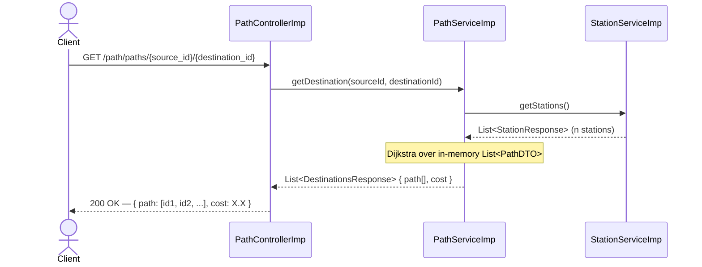
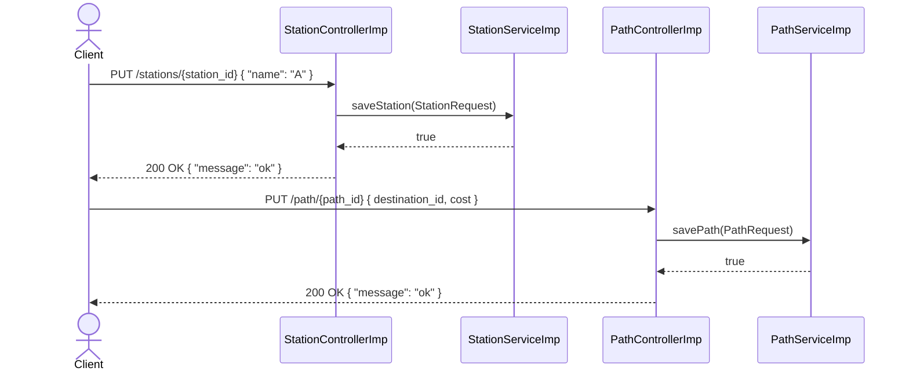

# MS-Recorrido — Travel Route Optimizer


A RESTful microservice that stores stations and bidirectional paths **in-memory** and resolves the **optimal (lowest-cost) route** between any two stations using Dijkstra's algorithm. Built as a backend code challenge in under 2 days.

> Repository: [github.com/jaimeemi/MS-Recorrido](https://github.com/jaimeemi/MS-Recorrido)

---

## Tech Stack & Infrastructure

- **Java 22** + **Spring Boot 3.3.2** (spring-boot-starter-web)
- **Lombok** — boilerplate reduction (`@Data`, `@AllArgsConstructor`, etc.)
- **Bean Validation** (jakarta.validation) — request-level input validation
- **In-memory storage** — `ArrayList`-backed repositories (no SQL, no external DB)
- **Dijkstra's Algorithm** — implemented in `PathServiceImp` for shortest-path resolution
- **Docker** — containerized with `amazoncorretto:22` base image, exposes port `8080`
- **Maven Wrapper** — reproducible builds via `./mvnw`
- **Testing** — JUnit 5 + Mockito + Spring MockMvc integration tests
- No CI/CD pipeline detected (GitHub Actions or similar not present — see [DevOps section](#devops--cicd-pipeline))

---

## Architecture / System Flow

The project follows a layered architecture with interface-based contracts at every layer, aligned with SOLID principles (especially Dependency Inversion).

```
HTTP Client
    │
    ▼
Controller Interface (PathController / StationsController)
    │  @RequestMapping, @PutMapping, @GetMapping
    ▼
Controller Implementation (PathControllerImp / StationControllerImp)
    │  Delegates to service via injected interface
    ▼
Service Interface (PathService / StationService)
    ▼
Service Implementation (PathServiceImp / StationServiceImp)
    │  In-memory List<PathDTO> / List<StationsDTO>
    │  PathServiceImp runs Dijkstra's algorithm for optimal route
    ▼
DTOs / Request / Response objects (Lombok-powered)
```

### Sequence Diagram — Optimal Route Query



### Sequence Diagram — Register Station & Path



---

## Prerequisites & Installation

### Requirements

| Tool | Version |
|------|---------|
| Java | 22+ |
| Maven | 3.8+ (or use `./mvnw`) |
| Docker | 20+ |

### Option 1 — Run Locally

```bash
git clone https://github.com/jaimeemi/MS-Recorrido.git
cd MS-Recorrido

./mvnw clean package -DskipTests

java -jar target/PathsStations-0.0.1-SNAPSHOT.jar
```

Service starts on **port `9000`** (configured in `application.properties`).

### Option 2 — Run with Docker

```bash
# 1. Build the JAR
./mvnw clean package -DskipTests

# 2. Build the Docker image
docker build -t ms-recorrido:latest .

# 3. Run the container
docker run -p 9000:8080 ms-recorrido:latest
```

> Note: The Dockerfile exposes port `8080` internally. Map it to `9000` on the host to match the app's configured port, or adjust as needed.

### Run Tests

```bash
./mvnw test
```

---

## Core Features & Endpoints

| Method | Endpoint | Description | Request Body | Response |
|--------|----------|-------------|--------------|----------|
| `PUT` | `/stations/{station_id}` | Register a new station | `{ "name": "string" }` | `{ "message": "ok" }` |
| `GET` | `/stations/` | List all registered stations | — | `[ { "id": 1, "name": "A" } ]` |
| `PUT` | `/path/{path_id}` | Register a bidirectional path | `{ "destination_id": long, "cost": double }` | `{ "message": "ok" }` |
| `GET` | `/path/` | List all registered paths | — | `[ { "id", "source_id", "destination_id", "cost" } ]` |
| `GET` | `/path/paths/{source_id}/{destination_id}` | Get optimal (lowest-cost) route | — | `[ { "path": [1,3,2], "cost": 80.0 } ]` |

### Example — Register Stations

```bash
curl -X PUT http://localhost:9000/stations/1 \
  -H "Content-Type: application/json" \
  -d '{"name": "Station A"}'

curl -X PUT http://localhost:9000/stations/2 \
  -H "Content-Type: application/json" \
  -d '{"name": "Station B"}'
```

### Example — Register a Path

```bash
# path_id=1, from station 1 to station 2, cost=50
curl -X PUT http://localhost:9000/path/1 \
  -H "Content-Type: application/json" \
  -d '{"destination_id": 2, "cost": 50}'
```

> The `path_id` in the URL acts as the `source_id` for the path (bidirectional).

### Example — Query Optimal Route

```bash
curl http://localhost:9000/path/paths/1/2
# Response: [{"path":[1,2],"cost":50.0}]
```

---

## Input Validation

Bean Validation is enforced at the controller layer via `@Valid`:

| Field | Rule |
|-------|------|
| `StationRequest.name` | `@NotBlank` — cannot be empty |
| `PathRequest.destination_id` | `@Min(1)` — must be a valid station ID |
| `PathRequest.cost` | `@Positive` + `@Min(1)` — must be a positive non-zero value |

Validation failures return `400 Bad Request` with descriptive messages.

---

## DevOps & CI/CD Pipeline

No CI/CD pipeline is currently configured in this repository. The following improvements are recommended for a production-grade setup:

### Suggested GitHub Actions Pipeline (`.github/workflows/ci.yml`)

```yaml
name: CI Pipeline
on: [push, pull_request]
jobs:
  build-and-test:
    runs-on: ubuntu-latest
    steps:
      - uses: actions/checkout@v4
      - uses: actions/setup-java@v4
        with:
          java-version: '22'
          distribution: 'corretto'
      - run: ./mvnw clean verify
      - name: Build & Push Docker image
        uses: docker/build-push-action@v5
        with:
          push: true
          tags: ghcr.io/jaimeemi/ms-recorrido:latest
```

### Additional Recommended Improvements

| Area | Suggestion |
|------|-----------|
| Observability | Add Spring Boot Actuator + Micrometer + Prometheus/Grafana |
| API Docs | Integrate SpringDoc OpenAPI (`/swagger-ui.html`) |
| Persistence | Replace in-memory lists with a proper store (Redis or H2 for testing) |
| Containerization | Add a `docker-compose.yml` for one-command local startup |
| Kubernetes | Add `Deployment` + `Service` manifests for cloud deployment |
| Security | Add Spring Security for endpoint protection |

---

## Project Structure

```
src/
├── main/java/com/ChallengeGalicia/PathsStations/
│   ├── Controller/          # Interfaces + implementations (PathControllerImp, StationControllerImp)
│   ├── Exceptions/          # Custom runtime exceptions
│   ├── Objects/
│   │   ├── DTO/             # Internal data transfer objects (PathDTO, StationsDTO)
│   │   ├── Request/         # Validated inbound request models
│   │   └── Response/        # Outbound response models
│   └── services/            # Service interfaces + implementations (Dijkstra logic here)
└── test/java/
    ├── ControllerTest/      # MockMvc integration tests
    └── ServicesTest/        # Unit tests with Mockito
```

---

## Author

**Jaime Emi** — [@jaimeemi](https://github.com/jaimeemi)
